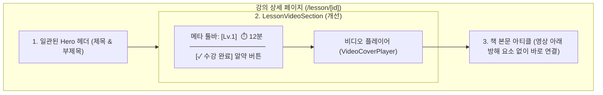

# Implementation Plan: 강의 상세 페이지 수강 완료 UI/UX 개편 (2안 적용)

## 1. 개요
강의 상세 페이지(`/lesson/[id]`)에서 영상 바로 아래에 위치하던 큰 카드 형태의 `LessonCompletionBar`를 제거하고, 영상 플레이어 바로 위 **초슬림 메타 툴바 라인**에 애플 스타일의 슬림 알약 캡슐(`[✓ 수강 완료]`) 버튼으로 재배치합니다.

이로써:
- 사이트 전체의 일관된 에디토리얼 헤더(제목 + 부제목) 타이포그래피 리듬을 100% 보존합니다.
- 영상 시청 후 곧바로 책 본문(Article)으로 몰입감 있게 이어집니다.
- 텍스트를 "수강 완료"로 단정하게 통일하여 레이아웃 흔들림(CLS)을 원천 방지하고 시각적 완성도를 극대화합니다.

---

## 2. 시각적 구조 다이어그램 (Mermaid)

---

## 3. 세부 변경 사항

### 1) `src/components/LessonCompletionBar.tsx` (알약 토글 캡슐로 리팩토링)
- **제거**: 기존 둔탁한 카드 외곽 테두리, "강의 수강 상태", "영상을 끝까지 보시면 학습 기록이 자동 저장됩니다" 등 2줄 텍스트 제거.
- **스타일**: 높이 32px(`h-8`), 둥근 알약(`rounded-full`), 글래스모피즘 테두리.
- **상태별 표현**:
  - **미완료**: 얇은 빈 원 아이콘(`Circle`) + 은은한 투명 고스트 버튼(`bg-[var(--card-surface)]/30`) + `수강 완료` 텍스트. 아직 완료되지 않은 To-Do 체크박스임을 명확히 전달하며, 호버 시 오렌지 테두리와 아이콘 컬러 반응.
  - **완료**: 차분한 에메랄드 틴트 서피스(`bg-emerald-500/15 text-emerald-600 dark:text-emerald-400 border border-emerald-500/30 font-bold`) + 꽉 찬 체크 아이콘(`CheckCircle2`) + `수강 완료` 텍스트.
  - **비회원 클릭 시**: `openAuthPopover()`를 호출하여 자연스러운 로그인 유도.
  - **회원 클릭 시**: `toggleLessonCompleted(lessonId)` 토글 및 완료 시 `triggerConfetti()` 폭죽 실행.
  - **툴팁**: `title` 속성으로 상태 안내 제공.

### 2) `src/components/LessonVideoSection.tsx` (위치 이동 및 메타 툴바 구축)
- 영상 플레이어 아래의 `<LessonCompletionBar />` 호출 제거.
- 영상 플레이어 상단에 `flex items-center justify-between px-1 pb-1` 메타 툴바 추가:
  - 좌측: `Lv.{levelNumber}` 뱃지 + 러닝타임(`Clock` 아이콘 + `duration`)
  - 우측: `<LessonCompletionBar lessonId={lessonId} />` 슬림 캡슐 배치.
- `LessonVideoSectionProps`에 `levelNumber?: number` 추가.

### 3) `src/app/lesson/[id]/page.tsx`
- `<LessonVideoSection>`에 `levelNumber={level.levelNumber}` 전달.

---

## 4. 검증 계획
1. **반응형 뷰포트 확인**:
   - 모바일(375px~430px): 메타 칩과 수강 완료 캡슐이 한 줄에 깔끔하게 정렬되는지 확인.
   - 데스크톱(1024px+): 시원한 양 끝 정렬 및 타이포그래피 정렬 확인.
2. **인터랙션 동작 테스트**:
   - 비회원 상태에서 클릭 시 AuthPopover 정상 오픈 여부.
   - 회원 상태에서 클릭 시 완료 토글 및 폭죽(Confetti) 트리거 여부.
   - 영상 종료 시 자동 완료 전환 정상 연동 여부.
3. **빌드 무결성 점검**: `npm run build` 또는 개발 서버 린트/컴파일 무결성 검증.
