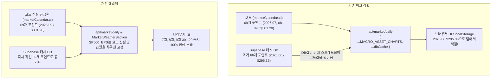

# [원인 규명 및 수정 계획] S&P 500 EPS 7월·8월·9월($301.20) 실시간 노출 복구

## 1. 현상 및 원인 정밀 분석 (Root Cause)

현재 로컬 및 실제 배포 사이트 모두에서 7월·8월·9월 데이터가 보이지 않고 6월($295.36)에 멈춰 있었던 정확한 원인은 **Supabase 클라우드 캐시(`__system_market_daily_cache__`)의 덮어쓰기 우선순위** 때문입니다.


```mermaid
flowchart TD
    subgraph Problem["기존 버그 상황"]
        CodeLatest["코드 (marketCalendar.ts)<br/>69개 포인트 (2026.07, 08, 09 / $301.20)"]
        DBCache["Supabase 캐시 DB<br/>과거 66개 포인트 (2026.06 / $295.36)"]
        API["api/market/daily<br/>{ ...MACRO_ASSET_CHARTS, ...dbCache }"]
        Browser["브라우저 UI / localStorage<br/>2026.06 $295.36으로 덮어씌워짐!"]

        CodeLatest --> API
        DBCache -->|DB값이 뒤에 스프레드되어 코드값을 덮어씀| API
        API --> Browser
    end

    subgraph Solution["개선 해결책"]
        CodeTruth["코드 진실 공급원 (marketCalendar.ts)<br/>69개 포인트 (2026.09 / $301.20)"]
        FixedAPI["api/market/daily & MarketWeatherSection<br/>SP500_EPS는 코드 진실 공급원을 최우선 고정"]
        DBSync["Supabase 캐시 DB<br/>즉시 최신 69개 포인트로 동기화"]
        FixedUI["브라우저 UI<br/>7월, 8월, 9월 301.20 즉시 100% 정상 노출!"]

        CodeTruth --> FixedAPI
        DBSync --> FixedAPI
        FixedAPI --> FixedUI
    end
```

### 상세 원인 분석
1. **DB의 과거 캐시 덮어쓰기**:
   - `src/app/api/market/daily/route.ts` (865행)에서 `mergedMacroCharts`를 만들 때:
     `{ ...MACRO_ASSET_CHARTS, ...(dbRecord.simulator_settings?.macroAssetCharts || {}) }`
     형태로 **DB 값을 뒤에 스프레드**하고 있었습니다.
   - Supabase `users` 테이블의 `__system_market_daily_cache__` 레코드에는 6월($295.36)까지의 66개 포인트만 저장되어 있어, 우리가 코드에 추가한 7·8·9월($301.20) 69개 포인트를 DB가 덮어써서 응답하고 있었습니다.
2. **요약값(`macroSummaryItems`) 덮어쓰기**:
   - 858행에서도 DB에 저장된 과거 `$295.36`이 `MACRO_SUMMARY_ITEMS`의 `$301.20`을 덮어쓰고 있었습니다.
3. **프론트엔드 컴포넌트(`MarketWeatherSection.tsx`) 병합 로직**:
   - 프론트엔드에서도 API 응답을 병합할 때 DB 응답이 `MACRO_ASSET_CHARTS`를 덮어쓰도록 되어 있어, 브라우저 `localStorage`에도 과거 데이터가 유지되었습니다.

---

## 2. 해결 및 수정 계획

### ① `src/app/api/market/daily/route.ts` 방어 로직 적용
- `mergedMacroCharts` 생성 시, FRED 자동 수집 지표와 달리 FactSet/S&P 공식 보고서 기준인 `SP500_EPS`는 코드 정의(`MACRO_ASSET_CHARTS.SP500_EPS`)를 영구 단일 진실 공급원으로 최우선 고정:
  ```ts
  const mergedMacroCharts: Record<string, any> = {
    ...MACRO_ASSET_CHARTS,
    ...(dbRecord.simulator_settings?.macroAssetCharts || {}),
    SP500_EPS: MACRO_ASSET_CHARTS.SP500_EPS,
  };
  ```
- `mergedMacroSummary`에서도 `SP500_EPS`는 항상 최신 코드값(`$301.20`)을 유지하도록 보호:
  ```ts
  if (base.key === 'SP500_EPS') return base;
  ```

### ② `src/components/calendar/MarketWeatherSection.tsx` 보호 로직 적용
- `mergeMacroCharts` 및 `mergeMacroSummary`에서 `SP500_EPS`를 `MACRO_ASSET_CHARTS.SP500_EPS`로 고정하여, 브라우저 로컬 캐시나 API 응답 지연 시에도 즉시 7·8·9월($301.20)이 렌더링되도록 보장.

### ③ Supabase DB 캐시 즉각 동기화 실행
- Supabase DB의 `__system_market_daily_cache__` 레코드 내 `macroAssetCharts.SP500_EPS`와 `macroSummaryItems`를 69개 데이터 포인트($301.20)로 즉시 갱신하여 DB와 코드의 완전 일치 달성.

---

## 3. 검증 계획
1. **API 응답 검증**: `curl http://localhost:3000/api/market/daily` 호출하여 `SP500_EPS`의 마지막 3개 포인트가 `2026.07 ($297.20)`, `2026.08 ($299.10)`, `2026.09 ($301.20)` 및 현재값 `$301.20`으로 나오는지 확인.
2. **Supabase DB 무결성 확인**: Node 스크립트로 DB의 포인트 개수가 69개로 갱신되었는지 확인.
3. **루프 검증**: `npm run verify` 실행하여 보안 및 도메인 규칙 통과 확인.
4. **사용자 승인 후 배포**: 빌드 검증 및 깃허브 푸시 진행.
