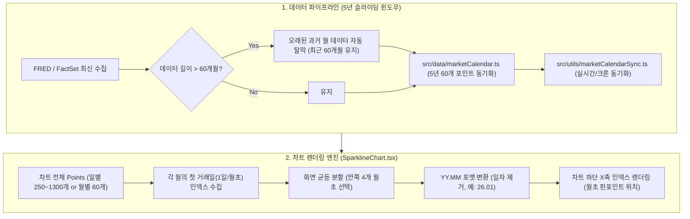

# 마켓인사이트 핵심 경제 지표 5년 슬라이딩 윈도우 및 차트 X축 월초 인덱스 통일 작업 계획

## 1. 개요 및 목적
1. **핵심 경제 지표 5년(60개월) 자동 슬라이딩 윈도우 확립**:
   - 기존에 `2021-01-01`로 고정(하드코딩)되어 약 70개월 치가 누적되던 기준금리, 소비자물가, 실업률, S&P 500 EPS 데이터를 신용스프레드와 동일하게 **정확히 최근 5년(60개월 / 20개 분기)**으로 제한하고, 새로운 월 데이터가 유입될 때마다 오래된 과거 데이터가 자동으로 탈락(Prune)되도록 파이프라인 전면 개편.
2. **차트 하단 X축 인덱스(눈금) '월초(1일) 기준 YY.MM' 통일**:
   - 일별 데이터(지수, 환율, 원자재, 신용스프레드)와 월별 데이터(기준금리, CPI 등) 간의 X축 날짜 표기 불일치 해소.
   - 10일, 23일 등 임의의 날짜가 아닌, **각 월의 첫 거래일(1일/월초)**에만 핀포인트로 인덱스 라벨이 위치하도록 개선.
   - 인덱스 라벨 텍스트에서 일자를 제거하고 **`YY.MM` (예: `25.04`, `26.01`)**으로 깔끔하게 통일.

---

## 2. 시각적 구조도 (Mermaid Diagram)

```mermaid
flowchart TD
    subgraph DataPipeline["1. 데이터 파이프라인 (5년 슬라이딩 윈도우)"]
        FRED["FRED / FactSet 최신 수집"] --> SlidingCheck{"데이터 길이 > 60개월?"}
        SlidingCheck -- "Yes" --> Prune["오래된 과거 월 데이터 자동 탈락 (최근 60개월 유지)"]
        SlidingCheck -- "No" --> Pass["유지"]
        Prune --> MarketCalendar["src/data/marketCalendar.ts (5년 60개 포인트 동기화)"]
        Pass --> MarketCalendar
        MarketCalendar --> SyncEngine["src/utils/marketCalendarSync.ts (실시간/크론 동기화)"]
    end

    subgraph ChartRendering["2. 차트 렌더링 엔진 (SparklineChart.tsx)"]
        Points["차트 전체 Points (일별 250~1300개 or 월별 60개)"] --> FindMonthStarts["각 월의 첫 거래일(1일/월초) 인덱스 수집"]
        FindMonthStarts --> PickTicks["화면 균등 분할 (안쪽 4개 월초 선택)"]
        PickTicks --> FormatMonth["YY.MM 포맷 변환 (일자 제거, 예: 26.01)"]
        FormatMonth --> XAxis["차트 하단 X축 인덱스 렌더링 (월초 핀포인트 위치)"]
    end

    DataPipeline --> ChartRendering
```

---

## 3. 세부 수정 계획

### 1) 차트 X축 월초 인덱스 통일 (`src/components/calendar/SparklineChart.tsx`)
- **월초(1일) 인덱스 감지 로직**:
  - `points` 배열을 순회하며 연·월(`YYYY.MM`)이 바뀌는 첫 번째 인덱스(그 달의 첫 거래일/1일)들을 추출 (`monthStartIndices`).
- **균등 분할 틱 선택**:
  - 추출된 월초 인덱스들 중 전체 구간을 고르게 대표하는 3~4개 월초 포인트를 선택하여 인덱스 라벨의 X축 위치(`ratio = idx / (points.length - 1)`)로 지정.
- **포맷터 통일**:
  - `formatChartMonth` 헬퍼 함수를 추가하여, 일자 정보가 있더라도 연도 2자리와 월만 추출하여 **`YY.MM` (예: `26.01`)** 형식으로 통일 렌더링.

### 2) 핵심 경제 지표 5년 슬라이딩 윈도우 자동화 (`scripts/update_market_data.py`)
- `update_macro_indicators()` 함수 내:
  - `if date >= '2021-01-01':` 하드코딩 제거.
  - 최신 관측값 기준 **정확히 최근 60개월(5년)**만 남기도록 슬라이딩 슬라이스 (`points = points[-60:]`).
  - 5년 전 시작점(`points[0]`) 대비 최신 종가(`points[-1]`)의 변동폭(`diff`, `change`) 재계산.

### 3) 기존 핵심 지표 데이터 60개월 정돈 (`src/data/marketCalendar.ts`)
- `MACRO_ASSET_CHARTS` 내 4대 지표(`DFEDTARU`, `CPI_YOY`, `UNEMPLOYMENT`, `SP500_EPS`)를 최근 60개월(2021.10 ~ 2026.09)로 정리.
- S&P 500 EPS 변동폭: 기존 2021.01($134.66) 대비 +123.7%에서, 2021.10($220.77) 대비 +36.4%로 정확하게 동기화.

### 4) 실시간 동기화 엔진 슬라이딩 가드 (`src/utils/marketCalendarSync.ts`)
- 신규 데이터 발표치 추가 시 `pts.length > 60`이면 앞부분을 슬라이스(`pts = pts.slice(-60)`)하여 상시 60개월 윈도우 보장.

---

## 4. 검증 계획
1. `npm run verify` (도메인 금지어, TypeScript 타입 체크, 보안 시크릿 검사).
2. 브라우저 및 빌드 테스트: 마켓인사이트 페이지에서 지수/대체자산/거시지표 차트 하단 인덱스가 모두 '1일(월초)' 기준 'YY.MM'으로 정렬되는지 확인.
